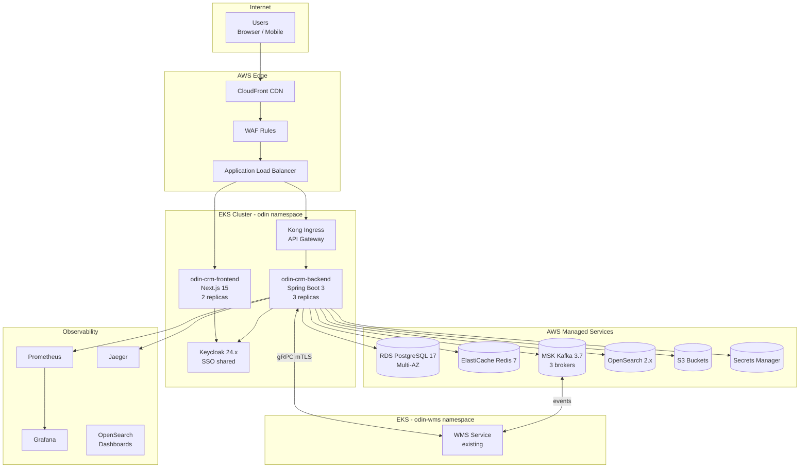
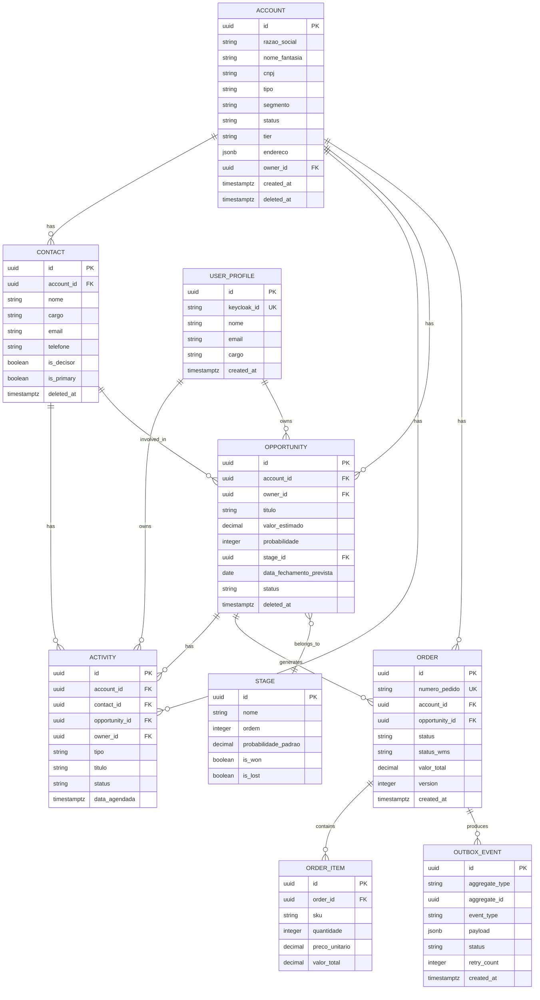
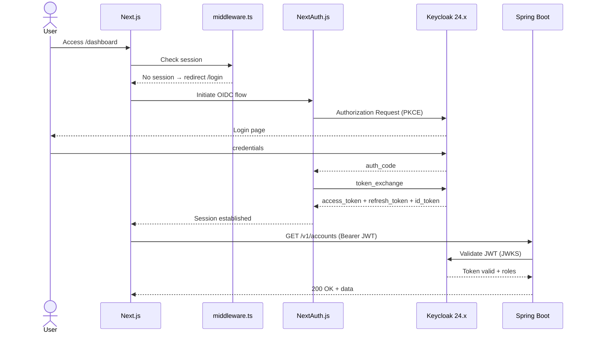
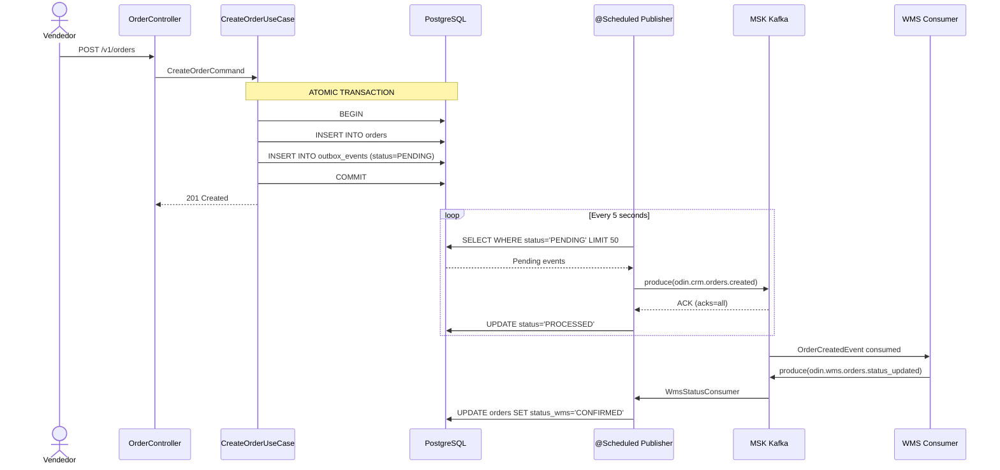
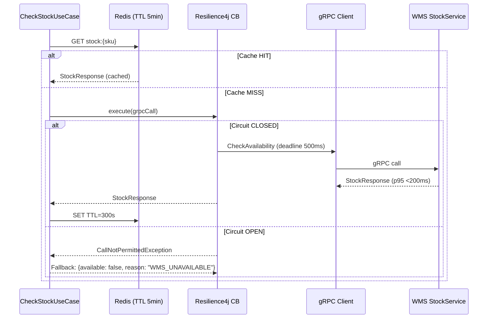
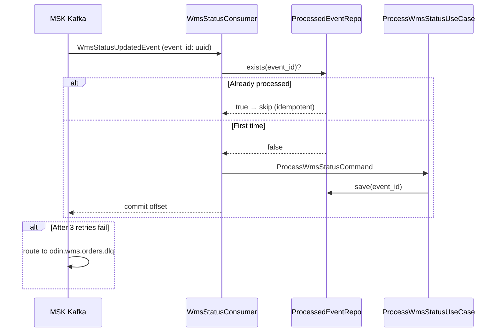

# ODIN CRM — Full Stack Architecture

**Version:** 1.0.0
**Date:** 2026-02-22
**Author:** @architect (Aria) — Synkra AIOS
**Status:** APPROVED ✅
**Checklist Score:** 15/15

---

## Table of Contents

1. [Introduction](#1-introduction)
2. [High Level Architecture](#2-high-level-architecture)
3. [Tech Stack](#3-tech-stack)
4. [Data Models](#4-data-models)
5. [API Specification](#5-api-specification)
6. [Components](#6-components)
7. [Core Workflows](#7-core-workflows)
8. [Database Schema](#8-database-schema)
9. [Frontend Architecture](#9-frontend-architecture)
10. [Backend Architecture](#10-backend-architecture)
11. [Unified Project Structure](#11-unified-project-structure)
12. [Development Workflow](#12-development-workflow)
13. [Deployment Architecture](#13-deployment-architecture)
14. [Security & Performance](#14-security--performance)
15. [Testing Strategy](#15-testing-strategy)
16. [Coding Standards](#16-coding-standards)
17. [Error Handling & Logging](#17-error-handling--logging)
18. [Monitoring](#18-monitoring)

---

## 1. Introduction

ODIN CRM é o segundo módulo do ODIN ERP — um grande sistema de gestão integrado para indústrias e varejistas. Este documento define a arquitetura técnica completa para implementação, servindo como **fonte única de verdade** para todas as decisões de design e desenvolvimento.

### Context

- **Sistema:** ODIN ERP (multi-módulo)
- **Módulos existentes:** WMS (em produção)
- **Este módulo:** CRM (segundo módulo)
- **Módulos futuros:** SCM, MRP, MRPII, Finance
- **Desenvolvedor:** Solo developer + AIOS AI-Assisted Development
- **Filosofia:** Qualidade sobre velocidade, sem prazo fixo

### Greenfield Decisions

Este é um projeto greenfield. Nenhum código legado existente para o CRM. O WMS já está em produção e serve como referência de integração.

### Key Constraints

- **C1:** Sem prazo fixo — qualidade é prioridade
- **C2:** Solo developer + assistência AIOS
- **C3:** Infraestrutura WMS (EKS, Keycloak, MSK) já em produção — compartilhar
- **C4:** Polyrepo: `odin-crm-backend`, `odin-crm-frontend`, `odin-proto`
- **C5:** Cloud: AWS (mesma conta do WMS)

---

## 2. High Level Architecture

### Technical Summary

ODIN CRM é construído sobre uma arquitetura de **microserviços** hospedada em **Amazon EKS**, utilizando **Spring Boot 3** no backend e **Next.js 15** no frontend. A integração com o WMS ocorre de forma **síncrona via gRPC** (consulta de estoque em tempo real) e **assíncrona via Apache Kafka MSK** (eventos de pedidos). O sistema utiliza **Keycloak** para SSO (já em produção para o WMS), **PostgreSQL 17** como banco primário, **OpenSearch** para busca e dashboards, e **Redis** para cache. Todo o tráfego inter-serviços é protegido por **Istio mTLS** e o acesso externo passa por **CloudFront + WAF + ALB**.

### AWS Platform Decisions

| Service | Usage | Tier |
|---------|-------|------|
| Amazon EKS 1.30 | Container orchestration — shared cluster with WMS | Shared |
| Amazon MSK (Kafka 3.7) | Async event streaming CRM ↔ WMS | kafka.t3.small |
| RDS PostgreSQL 17 | Primary database | db.t4g.medium |
| ElastiCache Redis 7 | Session cache + stock availability TTL | cache.t4g.small |
| OpenSearch 2.x | Full-text search + dashboard aggregations | t3.medium.search |
| ECR | Private Docker image registry | — |
| CloudFront | CDN for frontend assets + API proxy | — |
| ALB + WAF | HTTPS termination + DDoS protection | — |
| Route 53 | DNS: `crm.odin.internal` | — |
| S3 | Attachments, migration files, backups | Standard |
| Secrets Manager | DB credentials, API keys, Keycloak secrets | — |
| CloudWatch | Metrics collection → Grafana | — |

### Polyrepo Structure

```
odin-proto/                    ← Protobuf contracts (Maven + npm package)
odin-crm-backend/              ← Java 21 + Spring Boot 3 (multi-module Gradle)
odin-crm-frontend/             ← Next.js 15 App Router
```

### Architecture Diagram



### Architectural Patterns

| # | Pattern | Applied To |
|---|---------|-----------|
| 1 | Microservices / Database-per-service | Each ODIN module owns its DB |
| 2 | Event-Driven Architecture (Kafka) | Order events CRM → WMS, status updates WMS → CRM |
| 3 | Transactional Outbox Pattern | Atomic Order + OutboxEvent in same PostgreSQL TX |
| 4 | Circuit Breaker (Resilience4j) | gRPC calls to WMS — fallback on failure |
| 5 | CQRS Light | Writes to PostgreSQL, reads via OpenSearch for search/dashboard |
| 6 | Repository Pattern (DDD) | Domain ports + infrastructure adapters |
| 7 | BFF via Kong | API Gateway handles rate limiting, auth, routing |
| 8 | Istio Service Mesh | mTLS, traffic management, distributed tracing |
| 9 | SSR (Next.js App Router) | Server Components for initial page loads |
| 10 | Layered DDD | domain → application → infrastructure → interfaces |

---

## 3. Tech Stack

> **DEFINITIVE technology selection — Single source of truth for all development**

### 3.1 Frontend Stack

| Category | Technology | Version | Rationale |
|----------|-----------|---------|-----------|
| Language | TypeScript | 5.4+ | Type safety, IntelliSense, DDD alignment |
| Framework | Next.js | 15.x (App Router) | SSR/SSG, performance, file-based routing |
| Runtime | React | 19.x | Latest stable, concurrent features |
| UI Components | shadcn/ui | latest | Headless + Radix primitives, fully customizable |
| CSS | Tailwind CSS | 3.4+ | Utility-first, design consistency |
| State Management | Zustand | 4.x | Lightweight, no boilerplate, TypeScript-first |
| Server State | TanStack Query | 5.x | Cache, sync, background updates |
| Forms | React Hook Form + Zod | 7.x / 3.x | Performant, schema validation at boundary |
| HTTP Client | Axios | 1.x | Interceptors for auth token injection |
| Auth Client | NextAuth.js | 5.x (OIDC) | Keycloak OIDC integration |
| Charts | Recharts | 2.x | Sales dashboard, pipeline funnel, forecasts |
| Kanban | @dnd-kit | 6.x | Pipeline drag-and-drop, accessible |
| Tables | TanStack Table | 8.x | Virtual, sortable, filterable data grids |
| i18n | next-intl | 3.x | pt-BR primary, future en-US |
| Testing | Vitest + Testing Library | latest | Unit/component tests |
| E2E Testing | Playwright | 1.x | Full user flow validation |
| Package Manager | pnpm | 9.x | Speed, disk efficiency |

### 3.2 Backend Stack

| Category | Technology | Version | Rationale |
|----------|-----------|---------|-----------|
| Language | Java | 21 (LTS) | Virtual threads, records, sealed classes |
| Framework | Spring Boot | 3.3.x | Production-grade, Kubernetes-native |
| Build Tool | Gradle | 8.x (Kotlin DSL) | Faster than Maven, expressive config |
| API — REST | Spring MVC + OpenAPI 3.1 | — | Standard REST endpoints |
| API — Sync | gRPC + Protobuf | grpc-java 1.6x | CRM ↔ WMS real-time stock query |
| API — Async | Apache Kafka (MSK) | 3.7+ | Order events → WMS |
| Database | PostgreSQL | 17 (RDS) | ACID, JSONB, mature |
| Migrations | Flyway | 10.x | Versioned schema, CI/CD safe |
| ORM | Spring Data JPA + Hibernate | 6.x | Domain repository pattern |
| Cache | Redis (ElastiCache) | 7.x | Stock availability TTL cache |
| Search | OpenSearch | 2.x | Full-text search, dashboard aggregations |
| Auth Server | Keycloak | 24.x | SSO already in prod for WMS |
| Auth Filter | Spring Security + OAuth2 RS | 6.x | JWT validation, RBAC |
| Resilience | Resilience4j | 2.x | Circuit Breaker, Retry, Rate Limiter |
| Observability | Micrometer + Prometheus | 1.13+ | Metrics export |
| Tracing | OpenTelemetry + Jaeger | — | Distributed trace |
| Testing | JUnit 5 + Mockito | 5.x | Unit tests |
| Integration Tests | Testcontainers | 1.x | Postgres + Kafka + Redis in Docker |
| Contract Tests | Pact JVM | 4.x | CRM ↔ WMS gRPC contract |

### 3.3 Infrastructure & Platform

| Category | Technology | Rationale |
|----------|-----------|-----------|
| Container Orchestration | Amazon EKS 1.30+ | Shared cluster with WMS |
| Service Mesh | Istio 1.22+ | mTLS, traffic management |
| API Gateway | Kong Ingress Controller 3.x | Rate limiting, auth, routing |
| CDN | CloudFront | Next.js static assets |
| Container Registry | ECR | Private Docker images |
| IaC | Terraform 1.8+ | All AWS resources as code |
| CI/CD | GitHub Actions | Polyrepo pipelines |
| GitOps | ArgoCD 2.x | Continuous delivery to EKS |
| Performance Testing | k6 | NFR validation |
| Security Scanning | OWASP ZAP + Trivy | DAST + image scanning |

### 3.4 Version Constraints Summary

```
Java 21 LTS       → Spring Boot 3.3.x (requires Java 17+)
Node 20 LTS       → Next.js 15.x (requires Node 18+)
Kafka 3.7+        → MSK managed, KRaft mode (no ZooKeeper)
PostgreSQL 17     → RDS latest generation
Keycloak 24.x     → Compatible with existing WMS realm
gRPC Java 1.6x    → Protobuf 3.x contracts in odin-proto
Terraform 1.8+    → AWS provider ~> 5.0
```

---

## 4. Data Models

### 4.1 Domain Overview

```
┌─────────────────────────────────────────────────────────────┐
│                      ODIN CRM Domains                       │
├──────────────┬──────────────┬──────────────┬────────────────┤
│  ACCOUNTS    │  PIPELINE    │ INTEGRATION  │ SYSTEM         │
│              │              │              │                │
│  Account     │  Opportunity │  Order       │  UserProfile   │
│  Contact     │  Stage       │  OutboxEvent │  AuditLog      │
│  Activity    │  Forecast    │  StockCache  │                │
└──────────────┴──────────────┴──────────────┴────────────────┘
```

### 4.2 Entity Relationship Diagram



### 4.3 Key Design Decisions

- **Soft Delete:** `deleted_at IS NULL` como filtro de ativo. Nunca delete físico exceto por LGPD.
- **UUID v7 como PK:** Time-ordered, distribuídos, sem sequence contention.
- **JSONB para campos semi-estruturados:** `endereco`, `contatos_principais`, `preferencias`, `outbox payload`.
- **Outbox Pattern:** `INSERT orders` + `INSERT outbox_events` na mesma transação PostgreSQL.
- **Optimistic Locking:** `orders.version` via `@Version` JPA — previne conflitos de atualização de status WMS.
- **AES-256 para PII (LGPD):** `contact.email`, `contact.telefone`, `contact.whatsapp`, `account.cnpj`, `user_profile.email` — criptografados no nível da aplicação via `@Convert`.

### 4.4 OpenSearch Index (CQRS Read Side)

```json
{
  "index": "odin-crm-accounts",
  "mappings": {
    "properties": {
      "id":            { "type": "keyword" },
      "razao_social":  { "type": "text", "analyzer": "portuguese" },
      "nome_fantasia": { "type": "text", "analyzer": "portuguese" },
      "cnpj":          { "type": "keyword" },
      "segmento":      { "type": "keyword" },
      "status":        { "type": "keyword" },
      "tier":          { "type": "keyword" },
      "owner_id":      { "type": "keyword" },
      "total_orders":  { "type": "integer" },
      "total_revenue": { "type": "double" },
      "last_activity": { "type": "date" },
      "updated_at":    { "type": "date" }
    }
  }
}
```

Sync via **Debezium CDC** (Postgres WAL → MSK → OpenSearch Sink Connector).

---

## 5. API Specification

### 5.1 REST API Conventions

| Convention | Value |
|-----------|-------|
| Base URL | `https://api.crm.odin.internal/v1` |
| Auth | Bearer JWT (Keycloak) |
| Content-Type | `application/json` |
| Pagination | `?page=0&size=20&sort=createdAt,desc` |
| Errors | RFC 9457 Problem Details |
| Versioning | URL path (`/v1/`, `/v2/`) |

### 5.2 Accounts API

| Method | Path | Description | Roles |
|--------|------|-------------|-------|
| `GET` | `/v1/accounts` | List accounts (paginated) | `VENDEDOR`, `GERENTE` |
| `POST` | `/v1/accounts` | Create account | `VENDEDOR`, `GERENTE` |
| `GET` | `/v1/accounts/{id}` | Account 360° view | `VENDEDOR`, `GERENTE` |
| `PUT` | `/v1/accounts/{id}` | Full update | `VENDEDOR`, `GERENTE` |
| `PATCH` | `/v1/accounts/{id}` | Partial update | `VENDEDOR`, `GERENTE` |
| `DELETE` | `/v1/accounts/{id}` | Soft delete | `GERENTE` |
| `GET` | `/v1/accounts/{id}/contacts` | List contacts | `VENDEDOR`, `GERENTE` |
| `GET` | `/v1/accounts/{id}/opportunities` | List opportunities | `VENDEDOR`, `GERENTE` |
| `GET` | `/v1/accounts/{id}/orders` | List orders | `VENDEDOR`, `GERENTE`, `FINANCEIRO` |
| `GET` | `/v1/accounts/{id}/activities` | List activities | `VENDEDOR`, `GERENTE` |
| `GET` | `/v1/accounts/search?q=` | Full-text search (OpenSearch) | `VENDEDOR`, `GERENTE` |

### 5.3 Contacts API

| Method | Path | Description | Roles |
|--------|------|-------------|-------|
| `GET` | `/v1/contacts` | List contacts | `VENDEDOR`, `GERENTE` |
| `POST` | `/v1/contacts` | Create contact | `VENDEDOR`, `GERENTE` |
| `GET` | `/v1/contacts/{id}` | Get contact | `VENDEDOR`, `GERENTE` |
| `PUT` | `/v1/contacts/{id}` | Update contact | `VENDEDOR`, `GERENTE` |
| `DELETE` | `/v1/contacts/{id}` | Soft delete | `GERENTE` |
| `POST` | `/v1/contacts/{id}/anonymize` | LGPD anonymization | `ADMIN` |

### 5.4 Opportunities API

| Method | Path | Description | Roles |
|--------|------|-------------|-------|
| `GET` | `/v1/opportunities` | List (pipeline view) | `VENDEDOR`, `GERENTE` |
| `POST` | `/v1/opportunities` | Create | `VENDEDOR`, `GERENTE` |
| `GET` | `/v1/opportunities/{id}` | Detail | `VENDEDOR`, `GERENTE` |
| `PUT` | `/v1/opportunities/{id}` | Update | `VENDEDOR`, `GERENTE` |
| `PATCH` | `/v1/opportunities/{id}/stage` | Move stage (Kanban) | `VENDEDOR`, `GERENTE` |
| `PATCH` | `/v1/opportunities/{id}/won` | Mark as won | `VENDEDOR`, `GERENTE` |
| `PATCH` | `/v1/opportunities/{id}/lost` | Mark as lost + reason | `VENDEDOR`, `GERENTE` |
| `DELETE` | `/v1/opportunities/{id}` | Soft delete | `GERENTE` |
| `GET` | `/v1/opportunities/forecast` | Sales forecast report | `GERENTE` |
| `GET` | `/v1/opportunities/dashboard` | Sales dashboard | `VENDEDOR`, `GERENTE` |

### 5.5 Activities API

| Method | Path | Description | Roles |
|--------|------|-------------|-------|
| `GET` | `/v1/activities` | List my activities | `VENDEDOR`, `GERENTE` |
| `POST` | `/v1/activities` | Create activity | `VENDEDOR`, `GERENTE` |
| `GET` | `/v1/activities/{id}` | Detail | `VENDEDOR`, `GERENTE` |
| `PUT` | `/v1/activities/{id}` | Update | `VENDEDOR`, `GERENTE` |
| `PATCH` | `/v1/activities/{id}/complete` | Mark completed | `VENDEDOR`, `GERENTE` |
| `DELETE` | `/v1/activities/{id}` | Delete | `VENDEDOR`, `GERENTE` |

### 5.6 Orders API

| Method | Path | Description | Roles |
|--------|------|-------------|-------|
| `GET` | `/v1/orders` | List orders | `VENDEDOR`, `GERENTE`, `FINANCEIRO` |
| `POST` | `/v1/orders` | Create order (triggers Outbox) | `VENDEDOR`, `GERENTE` |
| `GET` | `/v1/orders/{id}` | Detail + WMS status | `VENDEDOR`, `GERENTE`, `FINANCEIRO` |
| `GET` | `/v1/orders/{id}/tracking` | WMS tracking timeline | `VENDEDOR`, `GERENTE`, `COMPRADOR` |
| `POST` | `/v1/orders/{id}/cancel` | Request cancellation | `GERENTE` |

### 5.7 Stock API (gRPC Bridge → REST)

| Method | Path | Description |
|--------|------|-------------|
| `GET` | `/v1/stock/{sku}/availability` | Real-time stock (gRPC → WMS) |
| `POST` | `/v1/stock/batch-availability` | Batch SKU check |

### 5.8 gRPC Service Definition

```protobuf
syntax = "proto3";
package odin.wms.v1;

service StockService {
  rpc CheckAvailability (StockRequest) returns (StockResponse);
  rpc CheckBatchAvailability (BatchStockRequest) returns (BatchStockResponse);
}

message StockRequest {
  string sku = 1;
  int32  quantity_requested = 2;
}

message StockResponse {
  string  sku              = 1;
  bool    available        = 2;
  int32   quantity_on_hand  = 3;
  int32   quantity_reserved = 4;
  string  warehouse_id    = 5;
  string  updated_at      = 6;
}

message BatchStockRequest  { repeated StockRequest  items = 1; }
message BatchStockResponse { repeated StockResponse items = 1; }
```

**gRPC SLA:** Timeout 500ms client deadline · CB opens after 5 failures in 10s · Target p95 < 200ms (NFR1)

### 5.9 Kafka Topics

| Topic | Producer | Consumer | Partitions | Retention |
|-------|----------|----------|-----------|-----------|
| `odin.crm.orders.created` | CRM (Outbox) | WMS | 12 | 7 days |
| `odin.crm.orders.cancelled` | CRM (Outbox) | WMS | 6 | 7 days |
| `odin.wms.orders.status_updated` | WMS | CRM | 12 | 7 days |
| `odin.wms.orders.dlq` | Kafka (retry failed) | CRM ops | 3 | 30 days |

**Order Created Event Schema:**
```json
{
  "event_id": "uuid-v7",
  "event_type": "ORDER_CREATED",
  "occurred_at": "2024-01-15T10:30:00Z",
  "aggregate": "ORDER",
  "aggregate_id": "uuid-v7",
  "payload": {
    "order_number": "PED-2024-00001",
    "account_cnpj": "12.345.678/0001-99",
    "account_name": "Indústria XYZ Ltda",
    "items": [{ "sku": "PROD-001", "quantity": 100, "unit_price": 25.50 }],
    "total_value": 2550.00,
    "currency": "BRL",
    "expected_delivery": "2024-02-01"
  },
  "metadata": { "crm_version": "1.0.0", "correlation_id": "uuid-v7" }
}
```

---

## 6. Components

### 6.1 Backend DDD Layer Structure

```
odin-crm-backend/src/main/java/br/com/odin/crm/
├── domain/           ← Pure business logic, zero framework deps
│   ├── account/      (Account aggregate, Cnpj value object, AccountRepository port)
│   ├── opportunity/  (Opportunity aggregate, Stage entity, Money value object)
│   ├── order/        (Order aggregate, OrderItem, OutboxEvent, OrderRepository)
│   ├── activity/     (Activity aggregate)
│   └── shared/       (DomainException, AggregateRoot, UuidV7)
│
├── application/      ← Use cases, orchestration
│   ├── account/      (CreateAccount, UpdateAccount, GetAccount360, AnonymizeAccount)
│   ├── opportunity/  (CreateOpportunity, MoveStage, CloseOpportunity, SalesForecast)
│   ├── order/        (CreateOrder, CancelOrder, ProcessWmsStatusUpdate)
│   ├── activity/     (CreateActivity)
│   └── stock/        (CheckStockAvailability, StockGrpcPort interface)
│
├── infrastructure/   ← Adapters: DB, Kafka, gRPC, Cache, Search
│   ├── persistence/  (JPA entities, Spring Data repos, repository adapters)
│   ├── messaging/    (KafkaConfig, OrderCreatedPublisher, WmsStatusConsumer)
│   │   └── order/    (OutboxPublisherScheduler — @Scheduled)
│   ├── grpc/         (WmsStockGrpcClient with Resilience4j CB)
│   ├── cache/        (StockAvailabilityRedisCache — TTL 5min)
│   ├── search/       (AccountOpenSearchAdapter)
│   └── security/     (PiiEncryptionConverter — AES-256)
│
└── interfaces/       ← HTTP controllers, exception handlers, security config
    ├── rest/         (AccountController, OpportunityController, OrderController...)
    ├── exception/    (GlobalExceptionHandler — RFC 9457)
    └── security/     (SecurityConfig, RlsSessionInterceptor)
```

### 6.2 Backend Component Interaction

```mermaid
graph TD
    HTTP[HTTP Request] --> CTRL[REST Controller]
    CTRL --> UC[Use Case]
    UC --> DOM[Domain Aggregate]
    UC --> REPO[Repository Port]
    REPO --> JPA[JPA Adapter → PostgreSQL]
    UC --> GRPC[gRPC Port]
    GRPC --> WMS[WMS StockService]
    UC --> SEARCH[OpenSearch Adapter]
    SCHED[@Scheduled Outbox Publisher] --> OUTBOX[(outbox_events)]
    OUTBOX --> KAFKA[Kafka Producer → MSK]
    KCONSUMER[Kafka Consumer] --> UC2[ProcessWmsStatus UseCase]
    UC2 --> REPO
```

### 6.3 Frontend Module Structure

```
odin-crm-frontend/
├── app/              ← Next.js 15 App Router
│   ├── (auth)/login  ← Keycloak OIDC redirect
│   └── (dashboard)/  ← Shell: sidebar + topbar
│       ├── page.tsx  ← Dashboard home
│       ├── accounts/ ← List, [id] 360°, new, edit
│       ├── opportunities/ ← Kanban, [id], forecast
│       ├── orders/   ← List, [id], new (multi-step)
│       └── activities/ ← Agenda view
├── components/
│   ├── ui/           ← shadcn/ui primitives
│   ├── layout/       ← Sidebar, Topbar, Shell
│   ├── accounts/     ← AccountCard, AccountForm, AccountTable, Account360View
│   ├── opportunities/ ← KanbanBoard, OpportunityCard, ForecastChart
│   ├── orders/       ← OrderForm, StockAvailabilityBadge, WmsTrackingTimeline
│   └── shared/       ← DataTable, ConfirmDialog, ErrorBoundary, Skeletons
├── lib/
│   ├── api/          ← Axios client + typed API functions per domain
│   ├── hooks/        ← TanStack Query hooks per domain
│   ├── stores/       ← Zustand: uiStore, pipelineStore
│   └── validations/  ← Zod schemas per domain
└── middleware.ts     ← Auth guard (Edge Runtime)
```

---

## 7. Core Workflows

### 7.1 Authentication Flow (Keycloak OIDC)



### 7.2 Create Order — Outbox Pattern



### 7.3 Stock Check — Circuit Breaker



### 7.4 WMS Status Update — Idempotent Consumer



---

## 8. Database Schema

### 8.1 Flyway Migration Files

```
src/main/resources/db/migration/
├── V1__create_schemas.sql
├── V2__create_accounts.sql
├── V3__create_contacts.sql
├── V4__create_stages.sql
├── V5__create_opportunities.sql
├── V6__create_activities.sql
├── V7__create_orders.sql
├── V8__create_outbox_events.sql
├── V9__create_user_profiles.sql
├── V10__create_audit_logs.sql
├── V11__create_processed_events.sql
├── V12__create_indexes.sql
├── V13__seed_stages.sql
└── V14__enable_rls.sql
```

### 8.2 Complete DDL

```sql
-- V1__create_schemas.sql
CREATE EXTENSION IF NOT EXISTS "pgcrypto";
CREATE EXTENSION IF NOT EXISTS "pg_trgm";

-- V2__create_accounts.sql
CREATE TABLE accounts (
    id              UUID         NOT NULL DEFAULT gen_random_uuid(),
    razao_social    VARCHAR(255) NOT NULL,
    nome_fantasia   VARCHAR(255),
    cnpj            VARCHAR(18)  NOT NULL,         -- AES-256 encrypted
    cnpj_hash       VARCHAR(64)  NOT NULL,         -- SHA-256 for lookup
    tipo            VARCHAR(50)  NOT NULL DEFAULT 'INDUSTRIA'
                        CHECK (tipo IN ('INDUSTRIA','VAREJO','DISTRIBUIDOR','SERVICOS','OUTRO')),
    segmento        VARCHAR(100),
    status          VARCHAR(20)  NOT NULL DEFAULT 'ACTIVE'
                        CHECK (status IN ('ACTIVE','INACTIVE','PROSPECT','BLOCKED')),
    tier            CHAR(1)      NOT NULL DEFAULT 'C'
                        CHECK (tier IN ('A','B','C')),
    observacoes     TEXT,
    endereco        JSONB        NOT NULL DEFAULT '{}',
    contatos_principais JSONB    NOT NULL DEFAULT '[]',
    owner_id        UUID         NOT NULL,
    created_by      UUID         NOT NULL,
    created_at      TIMESTAMPTZ  NOT NULL DEFAULT NOW(),
    updated_at      TIMESTAMPTZ  NOT NULL DEFAULT NOW(),
    deleted_at      TIMESTAMPTZ,
    CONSTRAINT pk_accounts PRIMARY KEY (id),
    CONSTRAINT uq_accounts_cnpj_hash UNIQUE (cnpj_hash)
);

-- V3__create_contacts.sql
CREATE TABLE contacts (
    id          UUID         NOT NULL DEFAULT gen_random_uuid(),
    account_id  UUID         NOT NULL,
    nome        VARCHAR(255) NOT NULL,
    cargo       VARCHAR(100),
    email       VARCHAR(500),                      -- AES-256 encrypted
    email_hash  VARCHAR(64),                       -- SHA-256 for dedup
    telefone    VARCHAR(100),                      -- AES-256 encrypted
    whatsapp    VARCHAR(100),                      -- AES-256 encrypted
    is_decisor  BOOLEAN      NOT NULL DEFAULT FALSE,
    is_primary  BOOLEAN      NOT NULL DEFAULT FALSE,
    status      VARCHAR(20)  NOT NULL DEFAULT 'ACTIVE'
                    CHECK (status IN ('ACTIVE','INACTIVE')),
    created_by  UUID         NOT NULL,
    created_at  TIMESTAMPTZ  NOT NULL DEFAULT NOW(),
    updated_at  TIMESTAMPTZ  NOT NULL DEFAULT NOW(),
    deleted_at  TIMESTAMPTZ,
    CONSTRAINT pk_contacts PRIMARY KEY (id),
    CONSTRAINT fk_contacts_account FOREIGN KEY (account_id) REFERENCES accounts(id)
);

-- V4__create_stages.sql
CREATE TABLE stages (
    id                   UUID        NOT NULL DEFAULT gen_random_uuid(),
    nome                 VARCHAR(100) NOT NULL,
    ordem                INTEGER     NOT NULL,
    probabilidade_padrao SMALLINT    NOT NULL DEFAULT 50
                             CHECK (probabilidade_padrao BETWEEN 0 AND 100),
    is_won               BOOLEAN     NOT NULL DEFAULT FALSE,
    is_lost              BOOLEAN     NOT NULL DEFAULT FALSE,
    is_active            BOOLEAN     NOT NULL DEFAULT TRUE,
    created_at           TIMESTAMPTZ NOT NULL DEFAULT NOW(),
    CONSTRAINT pk_stages PRIMARY KEY (id),
    CONSTRAINT uq_stages_ordem UNIQUE (ordem),
    CONSTRAINT chk_stages_won_lost CHECK (NOT (is_won AND is_lost))
);

-- V5__create_opportunities.sql
CREATE TABLE opportunities (
    id                      UUID         NOT NULL DEFAULT gen_random_uuid(),
    account_id              UUID         NOT NULL,
    owner_id                UUID         NOT NULL,
    titulo                  VARCHAR(255) NOT NULL,
    valor_estimado          NUMERIC(15,2),
    moeda                   CHAR(3)      NOT NULL DEFAULT 'BRL',
    probabilidade           SMALLINT     NOT NULL DEFAULT 50
                                CHECK (probabilidade BETWEEN 0 AND 100),
    stage_id                UUID         NOT NULL,
    data_fechamento_prevista DATE,
    data_fechamento_real    DATE,
    status                  VARCHAR(20)  NOT NULL DEFAULT 'OPEN'
                                CHECK (status IN ('OPEN','WON','LOST','CANCELLED')),
    motivo_perda            VARCHAR(255),
    observacoes             TEXT,
    created_by              UUID         NOT NULL,
    created_at              TIMESTAMPTZ  NOT NULL DEFAULT NOW(),
    updated_at              TIMESTAMPTZ  NOT NULL DEFAULT NOW(),
    deleted_at              TIMESTAMPTZ,
    CONSTRAINT pk_opportunities PRIMARY KEY (id),
    CONSTRAINT fk_opp_account FOREIGN KEY (account_id) REFERENCES accounts(id),
    CONSTRAINT fk_opp_stage   FOREIGN KEY (stage_id)   REFERENCES stages(id)
);

-- V6__create_activities.sql
CREATE TABLE activities (
    id               UUID        NOT NULL DEFAULT gen_random_uuid(),
    account_id       UUID,
    contact_id       UUID,
    opportunity_id   UUID,
    owner_id         UUID        NOT NULL,
    tipo             VARCHAR(30) NOT NULL
                         CHECK (tipo IN ('CALL','MEETING','EMAIL','TASK','WHATSAPP','VISIT')),
    titulo           VARCHAR(255) NOT NULL,
    descricao        TEXT,
    status           VARCHAR(20) NOT NULL DEFAULT 'SCHEDULED'
                         CHECK (status IN ('SCHEDULED','COMPLETED','CANCELLED','NO_SHOW')),
    data_agendada    TIMESTAMPTZ,
    data_realizada   TIMESTAMPTZ,
    duracao_minutos  INTEGER     CHECK (duracao_minutos > 0),
    created_by       UUID        NOT NULL,
    created_at       TIMESTAMPTZ NOT NULL DEFAULT NOW(),
    updated_at       TIMESTAMPTZ NOT NULL DEFAULT NOW(),
    CONSTRAINT pk_activities PRIMARY KEY (id),
    CONSTRAINT fk_activity_account     FOREIGN KEY (account_id)     REFERENCES accounts(id),
    CONSTRAINT fk_activity_contact     FOREIGN KEY (contact_id)     REFERENCES contacts(id),
    CONSTRAINT fk_activity_opportunity FOREIGN KEY (opportunity_id) REFERENCES opportunities(id)
);

-- V7__create_orders.sql
CREATE TABLE orders (
    id                    UUID         NOT NULL DEFAULT gen_random_uuid(),
    numero_pedido         VARCHAR(30)  NOT NULL,
    account_id            UUID         NOT NULL,
    opportunity_id        UUID,
    owner_id              UUID         NOT NULL,
    status                VARCHAR(30)  NOT NULL DEFAULT 'DRAFT'
                              CHECK (status IN ('DRAFT','SUBMITTED','CONFIRMED','CANCELLED')),
    status_wms            VARCHAR(30)  DEFAULT 'PENDING'
                              CHECK (status_wms IN (
                                  'PENDING','CONFIRMED','PICKING',
                                  'PACKED','SHIPPED','DELIVERED','CANCELLED')),
    valor_total           NUMERIC(15,2) NOT NULL,
    moeda                 CHAR(3)      NOT NULL DEFAULT 'BRL',
    data_entrega_prevista DATE,
    data_entrega_real     DATE,
    observacoes           TEXT,
    version               INTEGER      NOT NULL DEFAULT 0,
    created_by            UUID         NOT NULL,
    created_at            TIMESTAMPTZ  NOT NULL DEFAULT NOW(),
    updated_at            TIMESTAMPTZ  NOT NULL DEFAULT NOW(),
    CONSTRAINT pk_orders   PRIMARY KEY (id),
    CONSTRAINT uq_orders_numero UNIQUE (numero_pedido),
    CONSTRAINT fk_orders_account     FOREIGN KEY (account_id)     REFERENCES accounts(id),
    CONSTRAINT fk_orders_opportunity FOREIGN KEY (opportunity_id) REFERENCES opportunities(id)
);

CREATE TABLE order_items (
    id                  UUID         NOT NULL DEFAULT gen_random_uuid(),
    order_id            UUID         NOT NULL,
    sku                 VARCHAR(100) NOT NULL,
    descricao           VARCHAR(255) NOT NULL,
    quantidade          INTEGER      NOT NULL CHECK (quantidade > 0),
    preco_unitario      NUMERIC(15,2) NOT NULL CHECK (preco_unitario >= 0),
    desconto_percentual NUMERIC(5,2) NOT NULL DEFAULT 0
                            CHECK (desconto_percentual BETWEEN 0 AND 100),
    valor_total         NUMERIC(15,2) NOT NULL,
    version_estoque     INTEGER,
    CONSTRAINT pk_order_items PRIMARY KEY (id),
    CONSTRAINT fk_order_items_order FOREIGN KEY (order_id) REFERENCES orders(id) ON DELETE CASCADE
);

-- V8__create_outbox_events.sql
CREATE TABLE outbox_events (
    id              UUID        NOT NULL DEFAULT gen_random_uuid(),
    aggregate_type  VARCHAR(50) NOT NULL,
    aggregate_id    UUID        NOT NULL,
    event_type      VARCHAR(100) NOT NULL,
    payload         JSONB       NOT NULL,
    status          VARCHAR(20) NOT NULL DEFAULT 'PENDING'
                        CHECK (status IN ('PENDING','PROCESSED','FAILED')),
    retry_count     SMALLINT    NOT NULL DEFAULT 0,
    created_at      TIMESTAMPTZ NOT NULL DEFAULT NOW(),
    processed_at    TIMESTAMPTZ,
    error_message   TEXT,
    CONSTRAINT pk_outbox_events PRIMARY KEY (id)
);

-- V9__create_user_profiles.sql
CREATE TABLE user_profiles (
    id              UUID        NOT NULL DEFAULT gen_random_uuid(),
    keycloak_id     VARCHAR(36) NOT NULL,
    nome            VARCHAR(255) NOT NULL,
    email           VARCHAR(500) NOT NULL,   -- AES-256 encrypted
    email_hash      VARCHAR(64)  NOT NULL,   -- SHA-256 for lookup
    cargo           VARCHAR(100),
    telefone        VARCHAR(100),            -- AES-256 encrypted
    preferencias    JSONB        NOT NULL DEFAULT '{}',
    last_login_at   TIMESTAMPTZ,
    created_at      TIMESTAMPTZ  NOT NULL DEFAULT NOW(),
    updated_at      TIMESTAMPTZ  NOT NULL DEFAULT NOW(),
    CONSTRAINT pk_user_profiles PRIMARY KEY (id),
    CONSTRAINT uq_user_keycloak   UNIQUE (keycloak_id),
    CONSTRAINT uq_user_email_hash UNIQUE (email_hash)
);

-- V10__create_audit_logs.sql
CREATE TABLE audit_logs (
    id          UUID        NOT NULL DEFAULT gen_random_uuid(),
    entity_type VARCHAR(50) NOT NULL,
    entity_id   UUID        NOT NULL,
    action      VARCHAR(50) NOT NULL,
    actor_id    UUID        NOT NULL,
    actor_email VARCHAR(100),
    old_values  JSONB,
    new_values  JSONB,
    ip_address  INET,
    user_agent  VARCHAR(500),
    occurred_at TIMESTAMPTZ NOT NULL DEFAULT NOW(),
    CONSTRAINT pk_audit_logs PRIMARY KEY (id)
) PARTITION BY RANGE (occurred_at);
-- Retained 12 months per LGPD (NFR10)

-- V11__create_processed_events.sql
CREATE TABLE processed_events (
    event_id     UUID        NOT NULL,
    processed_at TIMESTAMPTZ NOT NULL DEFAULT NOW(),
    CONSTRAINT pk_processed_events PRIMARY KEY (event_id)
);

-- V12__create_indexes.sql
CREATE INDEX idx_accounts_owner    ON accounts(owner_id)     WHERE deleted_at IS NULL;
CREATE INDEX idx_accounts_status   ON accounts(status, tier) WHERE deleted_at IS NULL;
CREATE INDEX idx_accounts_trgm_razao   ON accounts USING gin(razao_social gin_trgm_ops);
CREATE INDEX idx_accounts_trgm_fantasia ON accounts USING gin(nome_fantasia gin_trgm_ops);
CREATE INDEX idx_contacts_account  ON contacts(account_id)   WHERE deleted_at IS NULL;
CREATE INDEX idx_opp_account_status ON opportunities(account_id, status) WHERE deleted_at IS NULL;
CREATE INDEX idx_opp_owner_stage   ON opportunities(owner_id, stage_id)  WHERE deleted_at IS NULL;
CREATE INDEX idx_opp_forecast      ON opportunities(data_fechamento_prevista, status)
                                   WHERE status = 'OPEN' AND deleted_at IS NULL;
CREATE INDEX idx_orders_account    ON orders(account_id);
CREATE INDEX idx_orders_status_wms ON orders(status_wms) WHERE status_wms NOT IN ('DELIVERED','CANCELLED');
CREATE INDEX idx_outbox_pending    ON outbox_events(created_at ASC) WHERE status = 'PENDING';
CREATE INDEX idx_activities_owner  ON activities(owner_id, data_agendada);
CREATE INDEX idx_audit_entity      ON audit_logs(entity_type, entity_id, occurred_at DESC);

-- V13__seed_stages.sql
INSERT INTO stages (id, nome, ordem, probabilidade_padrao, is_won, is_lost) VALUES
    (gen_random_uuid(), 'Prospecção',   1, 10,  FALSE, FALSE),
    (gen_random_uuid(), 'Qualificação', 2, 25,  FALSE, FALSE),
    (gen_random_uuid(), 'Proposta',     3, 50,  FALSE, FALSE),
    (gen_random_uuid(), 'Negociação',   4, 75,  FALSE, FALSE),
    (gen_random_uuid(), 'Fechamento',   5, 90,  FALSE, FALSE),
    (gen_random_uuid(), 'Ganho',        6, 100, TRUE,  FALSE),
    (gen_random_uuid(), 'Perdido',      7, 0,   FALSE, TRUE);

-- V14__enable_rls.sql
ALTER TABLE accounts      ENABLE ROW LEVEL SECURITY;
ALTER TABLE opportunities ENABLE ROW LEVEL SECURITY;
ALTER TABLE activities    ENABLE ROW LEVEL SECURITY;
ALTER TABLE orders        ENABLE ROW LEVEL SECURITY;

CREATE POLICY accounts_isolation ON accounts
    USING (
        current_setting('app.user_role') = 'GERENTE'
        OR owner_id = current_setting('app.user_id')::UUID
    );

CREATE POLICY opportunities_isolation ON opportunities
    USING (
        current_setting('app.user_role') = 'GERENTE'
        OR owner_id = current_setting('app.user_id')::UUID
    );

-- updated_at trigger
CREATE OR REPLACE FUNCTION set_updated_at()
RETURNS TRIGGER AS $$
BEGIN NEW.updated_at = NOW(); RETURN NEW; END;
$$ LANGUAGE plpgsql;

CREATE TRIGGER trg_accounts_updated_at     BEFORE UPDATE ON accounts     FOR EACH ROW EXECUTE FUNCTION set_updated_at();
CREATE TRIGGER trg_contacts_updated_at     BEFORE UPDATE ON contacts     FOR EACH ROW EXECUTE FUNCTION set_updated_at();
CREATE TRIGGER trg_opportunities_updated_at BEFORE UPDATE ON opportunities FOR EACH ROW EXECUTE FUNCTION set_updated_at();
CREATE TRIGGER trg_orders_updated_at       BEFORE UPDATE ON orders       FOR EACH ROW EXECUTE FUNCTION set_updated_at();
```

---

## 9. Frontend Architecture

### 9.1 Rendering Strategy

| Route | Rendering | Rationale |
|-------|-----------|-----------|
| `/login` | SSR | Dynamic session check |
| `/dashboard` | SSR (Server Component) | Initial data server-side, fast FCP |
| `/accounts` | SSR + Client hydration | First load SSR, SPA navigation |
| `/accounts/[id]` | SSR + Client hydration | Fast TTFB |
| `/opportunities` | Client Component | Kanban drag-and-drop |
| `/opportunities/forecast` | SSR | Report data, cacheable |
| `/orders` | SSR + Client hydration | List + filters |
| `/activities` | Client Component | Agenda interactions |

### 9.2 State Management Rules

```
SERVER STATE (async/remote)  → TanStack Query
  accounts, contacts, orders, opportunities, activities, stock

UI STATE (sync/local)        → Zustand
  sidebar collapsed, active tab, pipeline optimistic moves, modal state

FORM STATE                   → React Hook Form
  all form fields, validation errors, dirty/touched

URL STATE                    → Next.js router/searchParams
  filters, pagination, search queries
```

### 9.3 Authentication

```typescript
// middleware.ts — Edge Runtime auth guard
import { auth } from '@/lib/auth'
export default auth((req) => {
  const isAuthenticated = !!req.auth
  const isDashboard = req.nextUrl.pathname.startsWith('/dashboard')
  if (!isAuthenticated && isDashboard) {
    return Response.redirect(new URL('/login', req.url))
  }
})
```

```typescript
// lib/auth.ts — NextAuth 5 + Keycloak OIDC
export const { handlers, auth, signIn, signOut } = NextAuth({
  providers: [Keycloak({
    clientId: process.env.KEYCLOAK_CLIENT_ID!,
    clientSecret: process.env.KEYCLOAK_CLIENT_SECRET!,
    issuer: process.env.KEYCLOAK_ISSUER!,
  })],
  callbacks: {
    jwt({ token, account }) {
      if (account) token.accessToken = account.access_token
      return token
    },
    session({ session, token }) {
      session.accessToken = token.accessToken as string
      return session
    }
  }
})
```

### 9.4 Performance Budget

| Metric | Target | Strategy |
|--------|--------|----------|
| LCP | < 2.5s | SSR initial data, CloudFront CDN |
| INP | < 100ms | Server Components, minimal client JS |
| Bundle size | < 200kb gzipped | Dynamic imports, tree-shaking |
| API response | < 300ms p95 | TanStack Query cache + staleTime |

### 9.5 Environment Variables

```bash
NEXTAUTH_URL=https://crm.odin.internal
NEXTAUTH_SECRET=<generated>
KEYCLOAK_CLIENT_ID=odin-crm-frontend
KEYCLOAK_CLIENT_SECRET=<secret>
KEYCLOAK_ISSUER=https://auth.odin.internal/realms/odin
NEXT_PUBLIC_API_URL=https://api.crm.odin.internal/v1
```

---

## 10. Backend Architecture

### 10.1 Multi-Module Gradle Project

```
odin-crm-backend/
├── crm-domain/        ← Pure Java, zero Spring deps — domain aggregates + ports
├── crm-application/   ← Use cases, depends on domain only
├── crm-infrastructure/ ← Spring Data, Kafka, gRPC, Redis adapters
└── crm-web/           ← Spring Boot main app — controllers, security, Flyway
```

### 10.2 Spring Security Configuration

```java
@Configuration @EnableWebSecurity @EnableMethodSecurity
public class SecurityConfig {
    @Bean
    public SecurityFilterChain filterChain(HttpSecurity http) throws Exception {
        return http
            .csrf(csrf -> csrf.disable())
            .sessionManagement(s -> s.sessionCreationPolicy(STATELESS))
            .authorizeHttpRequests(auth -> auth
                .requestMatchers("/actuator/health", "/actuator/info").permitAll()
                .anyRequest().authenticated())
            .oauth2ResourceServer(oauth2 -> oauth2
                .jwt(jwt -> jwt.jwtAuthenticationConverter(keycloakConverter())))
            .build();
    }
}
// Controller: @PreAuthorize("hasAnyRole('VENDEDOR','GERENTE')")
```

### 10.3 gRPC Client + Circuit Breaker

```java
@Component
public class WmsStockGrpcClient implements StockGrpcPort {
    private final StockServiceGrpc.StockServiceBlockingStub stub;
    private final CircuitBreaker circuitBreaker;

    public StockAvailability checkAvailability(String sku, int quantity) {
        return circuitBreaker.executeSupplier(() -> {
            StockResponse r = stub.checkAvailability(
                StockRequest.newBuilder().setSku(sku).setQuantityRequested(quantity).build());
            return StockAvailability.from(r);
        });
    }

    public StockAvailability fallback(String sku, Exception ex) {
        log.warn("WMS unavailable for SKU {}: {}", sku, ex.getMessage());
        return StockAvailability.unavailable(sku, "WMS_UNAVAILABLE");
    }
}
```

**Resilience4j config:**
```yaml
resilience4j.circuitbreaker.instances.wms-stock:
  slidingWindowSize: 10
  failureRateThreshold: 50
  waitDurationInOpenState: 30s
  permittedNumberOfCallsInHalfOpenState: 3
```

### 10.4 Kafka Configuration Summary

- **Producer:** `acks=all`, `enable.idempotence=true`, `retries=3`
- **Consumer:** `enable.auto.commit=false`, manual ACK (`MANUAL_IMMEDIATE`)
- **DLQ:** `DefaultErrorHandler` with `FixedBackOff(1000ms, 3 retries)` → `DeadLetterPublishingRecoverer`
- **Consumer idempotency:** `processed_events` table deduplication before processing

### 10.5 Application Configuration

```yaml
spring:
  jpa:
    open-in-view: false
    hibernate.ddl-auto: validate        # Flyway manages schema
  flyway.enabled: true
  datasource.hikari:
    maximum-pool-size: 20
    minimum-idle: 5

management.endpoints.web.exposure.include: health,info,prometheus,metrics
```

---

## 11. Unified Project Structure

### 11.1 `odin-proto`

```
odin-proto/
├── proto/odin/wms/v1/stock_service.proto
├── build.gradle.kts          ← generates Java stubs
├── package.json              ← generates TS stubs
└── .github/workflows/publish.yml  ← publish to GitHub Packages on tag
```

### 11.2 `odin-crm-backend` (abbreviated)

```
odin-crm-backend/
├── .github/workflows/{ci,sonar,deploy}.yml
├── gradle/libs.versions.toml
├── crm-domain/src/main/java/br/com/odin/crm/domain/
│   ├── account/   contact/   opportunity/   order/   activity/   shared/
├── crm-application/src/main/java/br/com/odin/crm/application/
│   ├── account/   opportunity/   order/   activity/   stock/
├── crm-infrastructure/src/main/java/br/com/odin/crm/infrastructure/
│   ├── persistence/   messaging/kafka/   grpc/   cache/   search/   security/
├── crm-web/src/main/
│   ├── java/br/com/odin/crm/web/{rest,exception,security}/
│   └── resources/{application.yml,db/migration/V*.sql}
├── docker/Dockerfile
├── helm/odin-crm-backend/
└── docs/adr/
```

### 11.3 `odin-crm-frontend` (abbreviated)

```
odin-crm-frontend/
├── .github/workflows/{ci,deploy}.yml
├── app/{(auth)/login,(dashboard)/accounts,opportunities,orders,activities}/
├── components/{ui,layout,accounts,opportunities,orders,activities,shared}/
├── lib/{auth.ts,api/,hooks/,stores/,validations/,utils/}
├── middleware.ts
├── e2e/
├── docker/Dockerfile
└── helm/odin-crm-frontend/
```

### 11.4 Cross-Repo Dependency Graph

```
odin-proto
  ↓ Maven artifact  → odin-crm-backend (crm-infrastructure/grpc)
  ↓ npm package     → odin-crm-frontend (future TS gRPC client)

odin-crm-backend
  ↓ REST API        → odin-crm-frontend

odin-crm-backend ←── gRPC ──→ odin-wms-backend
odin-crm-backend ←── Kafka ──→ odin-wms-backend
```

---

## 12. Development Workflow

### 12.1 Local Development

```bash
# Start local infrastructure
docker compose -f docker/compose.yml up -d
# Services: PostgreSQL 17, Redis 7, Kafka 3.7 (KRaft), Keycloak 24, OpenSearch 2

# Backend
./gradlew :crm-web:bootRun --args='--spring.profiles.active=local'
# http://localhost:8080

# Frontend
pnpm install && pnpm dev
# http://localhost:3000
```

### 12.2 Git Branching — GitHub Flow

```
main ──────────────────────────────────────────► production
  ├── feature/STORY-1.1-spring-boot-skeleton
  ├── feature/STORY-2.1-account-domain
  ├── fix/order-outbox-retry-logic
  └── chore/update-spring-boot-3.3.2
```

**Commit convention:** `feat(account): implement Account aggregate [STORY-2.1]`

### 12.3 CI Pipeline Summary

**Backend CI:** test → coverage (80%) → Checkstyle → SpotBugs → SonarQube → build JAR → push ECR → update ArgoCD values

**Frontend CI:** typecheck → ESLint → Vitest (80% coverage) → Next.js build → Playwright E2E → push ECR

### 12.4 GitOps — ArgoCD

```
main push → CI updates helm/values-staging.yaml with new image tag
ArgoCD detects change → auto-sync to odin-crm-staging namespace
Smoke tests pass → manual sync to production via ArgoCD UI
```

### 12.5 Story Development Cycle (AIOS)

```
@sm *draft → @po *validate → @dev *develop → CodeRabbit scan
→ @qa *qa-gate → @devops *push → ArgoCD auto-sync → staging
```

---

## 13. Deployment Architecture

### 13.1 AWS Network Topology

```
VPC: 10.0.0.0/16 — us-east-1
├── us-east-1a: Public 10.0.1.0/24 (ALB, NAT) + Private 10.0.11.0/24 (EKS, RDS primary)
├── us-east-1b: Public 10.0.2.0/24             + Private 10.0.12.0/24 (EKS, RDS standby)
└── us-east-1c: Public 10.0.3.0/24             + Private 10.0.13.0/24 (EKS, MSK broker 3)

All EKS → AWS services via VPC Endpoints (no internet egress)
```

### 13.2 EKS Namespaces

```
odin-eks (shared cluster)
├── odin-crm        ← CRM backend (3 replicas) + frontend (2 replicas)
├── odin-wms        ← existing WMS
├── odin-keycloak   ← shared Keycloak
├── istio-system    ← Istio control plane
├── argocd          ← GitOps
└── monitoring      ← Prometheus + Grafana + Jaeger
```

### 13.3 Key K8s Resources

- **HPA:** backend min=3/max=10 (CPU 70%), frontend min=2/max=6
- **PDB:** `minAvailable: 2` for backend (never less than 2 pods during drain)
- **ExternalSecret:** pulls from AWS Secrets Manager, refresh 1h
- **Istio PeerAuthentication:** `STRICT` mTLS in all `odin-*` namespaces
- **preStop hook:** `sleep 15` + `terminationGracePeriodSeconds: 60` for graceful drain

### 13.4 Docker Multi-Stage Builds

**Backend:** `eclipse-temurin:21-jdk-alpine` (build) → `eclipse-temurin:21-jre-alpine` (runtime, non-root user)

**Frontend:** `node:20-alpine` (deps) → `node:20-alpine` (build) → `node:20-alpine` (Next.js standalone, non-root)

### 13.5 Disaster Recovery

| Resource | RPO | RTO | Strategy |
|----------|-----|-----|----------|
| RDS PostgreSQL | 1h | 30min | Automated snapshots + PITR 7 days |
| S3 | 0 | 5min | Versioning + Cross-region replication |
| MSK Kafka | 7 days | N/A | 7-day message retention (replay) |
| OpenSearch | 24h | 1h | Daily snapshots to S3 |
| K8s config | 0 | 15min | GitOps — git IS source of truth |

---

## 14. Security & Performance

### 14.1 Defense in Depth

```
Layer 1 — Network:    CloudFront WAF + ALB SG + Private Subnets
Layer 2 — Service Mesh: Istio mTLS STRICT + AuthorizationPolicy allowlist
Layer 3 — Application: Spring Security JWT + @PreAuthorize RBAC + Zod/Bean Validation
Layer 4 — Data:        RDS AES-256 at rest + AES-256/GCM PII fields + Secrets Manager
Layer 5 — Secrets:     Secrets Manager + External Secrets Op + GitLeaks pre-commit + Trivy
```

### 14.2 Keycloak RBAC Roles

| Role | Capabilities |
|------|-------------|
| `VENDEDOR` | CRUD own accounts/contacts/opportunities/activities; create orders; check stock |
| `GERENTE` | All VENDEDOR + view ALL records; delete; sales dashboard; cancel orders |
| `COMPRADOR` | Read-only: orders + WMS tracking |
| `FINANCEIRO` | Read-only: orders + account financial history |
| `ATENDIMENTO` | Read-only: accounts + contacts + order history |
| `ADMIN` | All + LGPD anonymization + user management |
| `PII_READ` | Required to read decrypted PII fields |

### 14.3 LGPD Compliance

| Requirement | Implementation |
|-------------|---------------|
| Minimização de dados | Coletar apenas campos necessários |
| Criptografia PII | AES-256/GCM: email, telefone, whatsapp, CNPJ |
| Right to be forgotten | `POST /v1/contacts/{id}/anonymize` — overwrites + soft delete |
| Audit trail 12 meses | `audit_logs` partitioned by month |
| Breach notification | CloudWatch alarm → SNS → email < 72h |

### 14.4 NFR Performance Strategies

| NFR | Target | Key Strategy |
|-----|--------|-------------|
| NFR1 — gRPC latency | p95 < 200ms | Redis cache TTL 5min + CB fallback + co-located services |
| NFR2 — Kafka delivery | < 5s E2E | Outbox poll 5s + MSK 3 brokers + parallel consumers |
| NFR4 — Uptime | ≥ 99.5%/month | 3 replicas + HPA + RDS Multi-AZ + PDB + CB |
| NFR7 — Frontend | p95 < 3s | SSR + CloudFront + dynamic imports + TanStack Query cache |

---

## 15. Testing Strategy

### 15.1 Testing Pyramid

```
            E2E (Playwright)          — 20 critical flows
          Performance (k6)            — NFR validation
        Contract (Pact)               — CRM ↔ WMS gRPC
      Integration (Testcontainers)    — DB, Kafka, Redis
    Unit Tests (JUnit 5 / Vitest)     — fast, many, isolated
```

**Coverage minimums:** Domain 90% · Application 85% · Infrastructure 70% · Controllers 80% · Frontend components 80%

### 15.2 Key Test Patterns

**Domain unit test:**
```java
@Test
void should_create_account_with_default_tier_C() {
    Account account = Account.create(new Cnpj("12.345.678/0001-99"), ...);
    assertThat(account.getTier()).isEqualTo(AccountTier.C);
}
```

**Use case test (Mockito):**
```java
@Test
void should_create_order_and_outbox_event_atomically() {
    // verify both orderRepository.save() and outboxRepository.save() called
    verify(orderRepository).save(any(Order.class));
    verify(outboxRepository).save(argThat(e -> e.getEventType().equals("ORDER_CREATED")));
}
```

**Integration test (Testcontainers):**
```java
@Testcontainers @SpringBootTest
class AccountRepositoryIntegrationTest {
    @Container static PostgreSQLContainer<?> postgres = new PostgreSQLContainer<>("postgres:17-alpine");
    // tests run against real Postgres in Docker
}
```

**E2E (Playwright):**
```typescript
test('should create account and view Account 360°', async ({ page }) => {
    await loginAsVendedor(page)
    await page.goto('/accounts/new')
    // fill form, submit, assert redirect to 360° view
})
```

**Performance (k6):**
```javascript
export const options = {
  thresholds: {
    'stock_grpc_latency': ['p(95)<200'],   // NFR1
    'http_req_duration':  ['p(95)<3000'],  // NFR7
  }
}
```

### 15.3 Security Testing

- **OWASP ZAP API Scan:** weekly + on release, fail CI on HIGH findings
- **Trivy:** container image scan on every Docker build
- **GitLeaks:** pre-commit hook blocks secret commits

---

## 16. Coding Standards

### 16.1 Java Conventions

- **Naming:** `PascalCase` classes, `camelCase` methods, `UPPER_SNAKE` constants
- **Java 21:** Use records for DTOs/VOs, sealed classes for domain results, pattern matching in switch, text blocks
- **Factory methods** on Aggregates — never public constructors
- **Use Cases:** one public `execute()` method, annotated with `@UseCase`
- **Repositories:** return `Optional<T>`, never null
- **No business logic** in controllers or JPA entities
- **@Transactional** only on Use Cases and Repository adapters

### 16.2 TypeScript/React Conventions

- **Naming:** `PascalCase` components, `useX` hooks, `xStore` stores, `xSchema` Zod schemas
- **Server Components** by default; `'use client'` only when needed
- **TanStack Query** for all async state — never `useEffect` for data fetching
- **Zod schemas** co-located in `lib/validations/`
- **No `any` type** — enforced by ESLint
- **Props interface** co-located with component

### 16.3 Universal Rules

- Comment **why**, not what
- No magic numbers/strings — use constants or enums
- One concept per file
- No commented-out code — use git history
- Methods max 40 lines (Checkstyle enforced)
- Parameters max 5 (use Command objects)

### 16.4 Linting Config

- **Backend:** Checkstyle (line 120, method 40 lines) + SpotBugs + `./gradlew checkstyleMain spotbugsMain`
- **Frontend:** ESLint (`@typescript-eslint/recommended-type-checked`) + Prettier + `pnpm lint`
- **Pre-commit:** GitLeaks (secret detection) + lint-staged

---

## 17. Error Handling & Logging

### 17.1 Exception Hierarchy

```
DomainException (422)        → InvalidCnpjException, InvalidStageTransitionException
NotFoundException (404)      → AccountNotFoundException, OrderNotFoundException
ConflictException (409)      → DuplicateCnpjException
UnauthorizedException (403)  → InsufficientPermissionsException
IntegrationException         → WmsUnavailableException (503), KafkaPublishException
```

### 17.2 HTTP Error Responses — RFC 9457

All errors return `ProblemDetail` with: `type`, `title`, `status`, `detail`, `instance`, `error_code`, `trace_id`

Unexpected errors (500): expose only `traceId` — never stack trace to client.

### 17.3 Structured Logging

```
Format: "%d{ISO8601} [%X{traceId},%X{spanId}] %-5level [%X{userId}] %logger{36} — %msg%n"
Production level: INFO for br.com.odin, WARN for frameworks
MDC populated per request: traceId (from Istio x-b3-traceid), spanId, userId, service
```

**Log levels:** ERROR=unexpected failures · WARN=expected failures/degraded · INFO=business events · DEBUG=troubleshooting

**Never log PII fields** (email, telefone, CNPJ) — log IDs only.

### 17.4 Distributed Tracing

OpenTelemetry auto-instruments all HTTP, `@Transactional`, Kafka, gRPC, JDBC, Redis operations.
Sampling: 100% staging, 10% production. Traces visible in Jaeger UI.
`traceId` returned in `X-Trace-Id` response header for client support.

### 17.5 Kafka Error Handling

- **Retry:** `FixedBackOff(1000ms, 3 retries)` on consumer failure
- **DLQ:** `DeadLetterPublishingRecoverer` → `odin.wms.orders.dlq` after 3 failures
- **Outbox:** retry_count++; after 5 failures → status=`FAILED`, alert triggered

### 17.6 Log Aggregation

```
Pod stdout → Fluent Bit DaemonSet → OpenSearch
Index: odin-crm-logs-{YYYY.MM.DD}
Retention: 90 days (NFR10) — ILM: hot(7d) → warm(30d) → cold(90d) → delete
```

---

## 18. Monitoring

### 18.1 Observability Stack

| Pillar | Collect | Store | Visualize |
|--------|---------|-------|-----------|
| Metrics | Micrometer/Prometheus scrape | Prometheus | Grafana |
| Logs | Fluent Bit DaemonSet | OpenSearch | OS Dashboards |
| Traces | OpenTelemetry SDK | Jaeger | Jaeger UI |

### 18.2 Key Prometheus Metrics

**Auto (Spring Boot Actuator):** `http_server_requests_seconds`, `jvm_memory_used_bytes`, `hikaricp_connections_active`, `kafka_consumer_lag`, `resilience4j_circuitbreaker_state`

**Custom Business Metrics:** `crm.orders.created.total`, `crm.opportunities.won.total`, `crm.opportunities.lost.total`, `crm.outbox.pending.count` (gauge), `crm.stock.check.duration` (timer p50/p95/p99)

### 18.3 SLIs and SLOs

| SLI | SLO | Alert Threshold |
|-----|-----|----------------|
| Availability | ≥ 99.5%/month | < 99.0% for 5min |
| API Latency p95 | < 500ms | > 1s for 3min |
| gRPC Latency p95 | < 200ms (NFR1) | > 400ms for 2min |
| Order Delivery | < 5s (NFR2) | Kafka lag > 1000 for 5min |
| Error Rate | < 0.5% | > 1% for 5min |
| Outbox Freshness | < 50 pending | > 100 for 10min |

**Monthly error budget:** 219 minutes (0.5% of 43,800 min)

### 18.4 Grafana Dashboards

1. **Service Health:** RED metrics (Rate/Errors/Duration) + JVM + DB connections + Pod replicas
2. **Integration Health:** WMS CB state + Outbox pending + Kafka consumer lag
3. **Business KPIs:** Opportunities created/won/lost + Pipeline funnel + Orders → WMS rate
4. **Jaeger Service Map:** CRM → WMS gRPC + Kafka async flow visualization

### 18.5 Alert Rules

| Alert | Condition | Severity |
|-------|-----------|----------|
| High error rate | HTTP 5xx > 1% for 5min | CRITICAL → PagerDuty |
| Outbox stale | pending > 100 for 10min | HIGH → Email |
| WMS CB open | state=OPEN for 2min | HIGH → Email |
| Kafka DLQ growth | DLQ messages > 10 for 5min | HIGH → Email |
| Pod crash loop | restarts > 3 in 15min | CRITICAL → PagerDuty |
| RDS connections | > 80% max for 5min | HIGH → Email |
| PII access anomaly | LGPD_READ > 100/hour/user | HIGH → Security Email |

### 18.6 Health Check Endpoints

```
GET /actuator/health/liveness   → K8s liveness probe (JVM alive)
GET /actuator/health/readiness  → K8s readiness probe (DB + Redis + Kafka)
GET /actuator/prometheus        → Prometheus metrics scrape
```

---

## Architecture Decision Records (ADR)

| ADR | Decision | Rationale |
|-----|----------|-----------|
| ADR-001 | Outbox Pattern for Order→WMS | Atomic tx guarantees no order lost on Kafka broker failure |
| ADR-002 | gRPC for stock queries | Low latency (<200ms p95); protobuf contract versioning in odin-proto |
| ADR-003 | PostgreSQL RLS for data isolation | Vendedor sees own records; Gerente sees all — enforced at DB layer |
| ADR-004 | Polyrepo strategy | Independent deploy cadence per service; clear ownership boundaries |
| ADR-005 | Keycloak SSO shared with WMS | Single user database; no credential duplication; existing infra |
| ADR-006 | CQRS Light (no event sourcing) | Full event sourcing is over-engineering for solo developer at this stage |
| ADR-007 | AES-256/GCM at application layer | Field-level encryption for LGPD PII; independent of DB-level encryption |

---

## Glossary

| Term | Definition |
|------|-----------|
| Account | Empresa/cliente cadastrada no CRM |
| Contact | Pessoa física vinculada a uma Account |
| Opportunity | Negociação em andamento no pipeline comercial |
| Stage | Etapa do pipeline (Prospecção, Qualificação, etc.) |
| Activity | Tarefa, ligação, reunião ou e-mail vinculado a Account/Contact/Opportunity |
| Order | Pedido de venda gerado a partir de uma Opportunity |
| OutboxEvent | Registro atômico de evento Kafka pendente de publicação |
| WMS | Warehouse Management System — primeiro módulo do ODIN ERP |
| MSK | Amazon Managed Streaming for Apache Kafka |
| EKS | Amazon Elastic Kubernetes Service |
| RLS | Row Level Security — PostgreSQL feature for data isolation |
| CB | Circuit Breaker — Resilience4j pattern for WMS failure isolation |
| CQRS | Command Query Responsibility Segregation — writes to PG, reads via OpenSearch |
| DDD | Domain-Driven Design — layered architecture pattern used in the backend |
| BFF | Backend for Frontend — Kong Gateway as thin API proxy |
| PII | Personally Identifiable Information — protected by LGPD |
| LGPD | Lei Geral de Proteção de Dados — Brazilian data protection law |

---

*ODIN CRM Architecture v1.0.0 — Generated by @architect (Aria) / Synkra AIOS — 2026-02-22*
